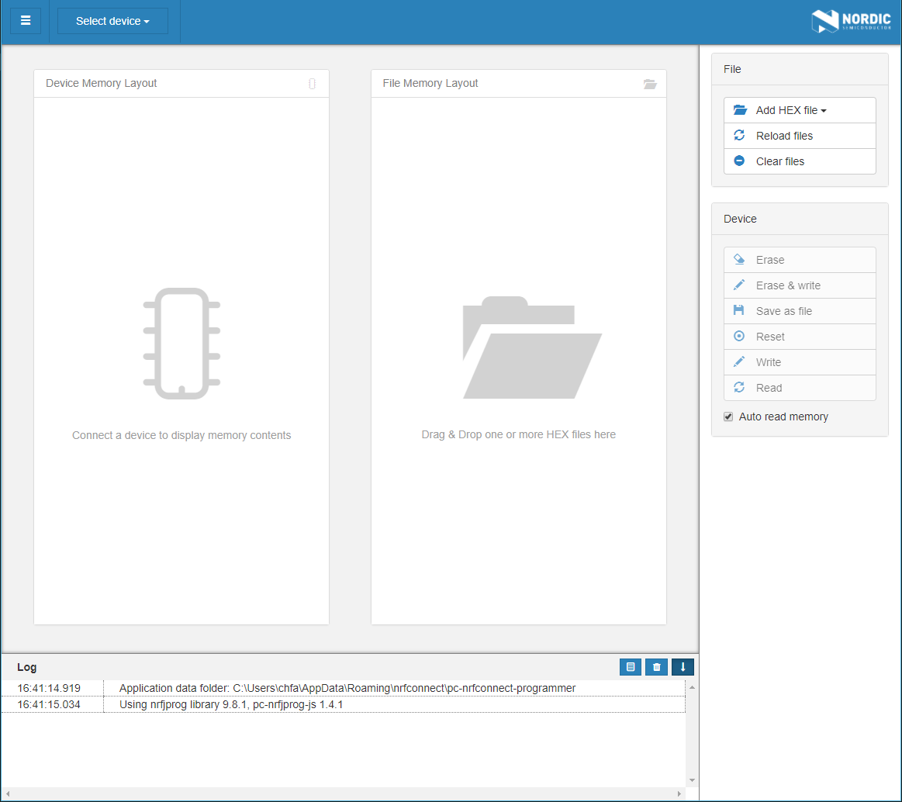
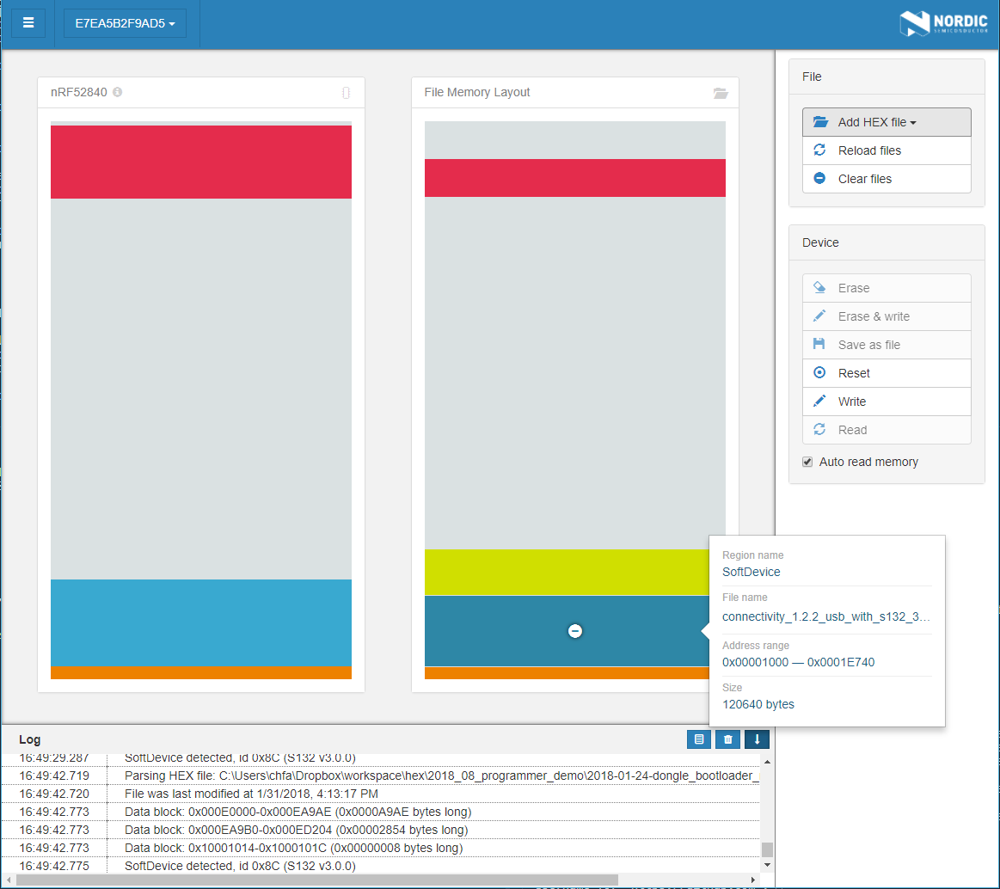

# nRF Connect Programmer

*nRF Connect Programmer* is a cross-platform tool that enables programming firmwares to device. Memory layout for both *JLink* and *Nordic USB* devices can be displayed. Content for the *HEX* files can be displayed, too. Moreover, content of *HEX* files can be written to the devices.

*nRF Connect Programmer* is implemented as an app for [nRF Connect](https://github.com/NordicSemiconductor/pc-nrfconnect-core#creating-apps).

Check which one is better.

The app supports the following devices:
* PCA10028 nRF51 Development Kit
* PCA10031 nRF51 Dongle
* PCA10040 nRF52 Development Kit
* PCA10056 nRF52 Development Kit
* PCA10059 nRF52 Dongle

# Installation

To install the application you can download binaries from the [nRF Connect product page](https://www.nordicsemi.com/eng/Products/Bluetooth-low-energy/nRF-Connect-for-desktop) on Nordic Semiconductor web pages.

nRF Connect currently supports the following operating systems:

* Windows
* Ubuntu Linux 64-bit
* macOS

After *nRF Connect* is installed, you can find *Programmer* in the app list by selecting *Add/remove apps*.

# Contributing

Feel free to file code related issues on [GitHub Issues](https://github.com/NordicSemiconductor/pc-nrfconnect-programmer/issues) and/or submit a pull request. In order to accept your pull request, we need you to sign our Contributor License Agreement (CLA). You will see instructions for doing this after having submitted your first pull request. You only need to sign the CLA once, so if you have already done it for another project in the NordicSemiconductor organization, you are good to go.

# Building from source

## Clone the repository

Open a terminal, go to the following directory, and clone the repository:

- Linux/macOS: `cd $HOME/.nrfconnect-apps/local`
- Windows: `cd %USERPROFILE%/.nrfconnect-apps/local`

Alternatively, clone the repository in a different directory and symlink it into `.nrfconnect-apps/local`.

## Dependencies

To build the app you will need to install the following tools:

* Node.js (>=6.9)
* npm (>=5.6.0) / yarn (>=1.4.0)
* libudev-dev (Linux)
* [nrf-udev](https://github.com/NordicSemiconductor/nrf-udev) (Linux)

## Building

After cloning the repository, install the required dependencies:

    npm install

Then build the app:

    npm run dev

If everything was successful, you should now be able to launch the app in nRF Connect.

## Testing

Unit testing can be performed by running:

    npm test

# License

See the [license file](LICENSE) for details.

# Feedback

* Ask questions on [DevZone Questions](https://devzone.nordicsemi.com)
* File code related issues on [GitHub Issues](https://github.com/NordicSemiconductor/pc-nrfconnect-programmer/issues)
