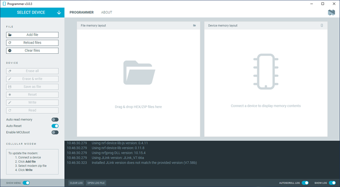

# Overview and user interface

The nRF Connect Programmer app main window displays the memory layout of the device and the file you want to work with. It also provides options to program the device and inspect the entire process through the log.

When you start the Programmer app, the following main window appears:

## Select Device

Once you connect a device to the system, it becomes visible and available when you click on the **Select device** drop-down list. You can choose a device from the list of connected devices to perform further actions on the device such as programming.

You can switch between the following application Tabs, using the navigation bar.

### Programmer tab

In the **Programmer** tab, you can see the memory sections for the selected device.

The **File Memory Layout** panel displays the memory layout for files added to the Programmer app with the **Add file** option. Once added, these files can be programmed onto the device.

Both windows display the different sections in the memory with different colors.

### Device

When you select a device, the following actions are available in the Device panel:

- **Erase all** clears the written memory on the device.
- **Read** reads and displays the written memory in the **Device Memory Layout**.

     - In the **Device Memory Layout**, you can read the name, address range, and size of a memory section by hovering the mouse cursor over one of the memory sections. This option is possible only after loading a memory layout.

        

     - Additionally, after you read the memory, **Save as file** allows you to save the memory as a HEX file.

- **Reset** resets the device.
- **Write** programs the files added to the **File Memory Layout**.
- **Erase & write** clears the written memory and programs the files added to the **File Memory Layout**.
- To automatically read and display the memory layout of the device when the device is selected, enable **Auto read memory**.
- To automatically reset the device after it has been programmed, enable **Auto Reset**.
- To program a Nordic USB device, **Enable MCUBoot** may be required to write to the device memory.

### File

In the File section, you can add files to the **File Memory Layout** graphic, reload, and remove them.

When adding files with the **Add file** button, you can select the files either from the drop-down list of previous files or by browsing to the file destination.

#### About Tab

You can view application information, restore settings to default, access source code, and documentation. You also can find information on the selected device, access support tools, and enable verbose logging.

#### Log

The Log panel allows you to view the most important log events, tagged with a timestamp. Each time you open the app, a new session log file is created. You can find the Log panel and its controls below the main application window.

- When troubleshooting, to view more detailed information than shown in the Log panel, use **Open log file** to open the current log file in a text editor.
- To clear the information currently displayed in the Log panel, use **Clear Log**. The contents of the log file are not affected.
- To hide or display the Log panel in the user interface, use **Show Log**.
- To freeze Log panel scrolling, use **Autoscroll Log**.