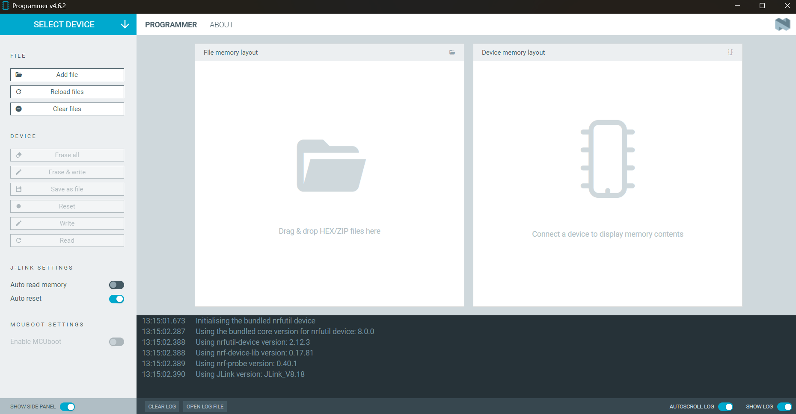
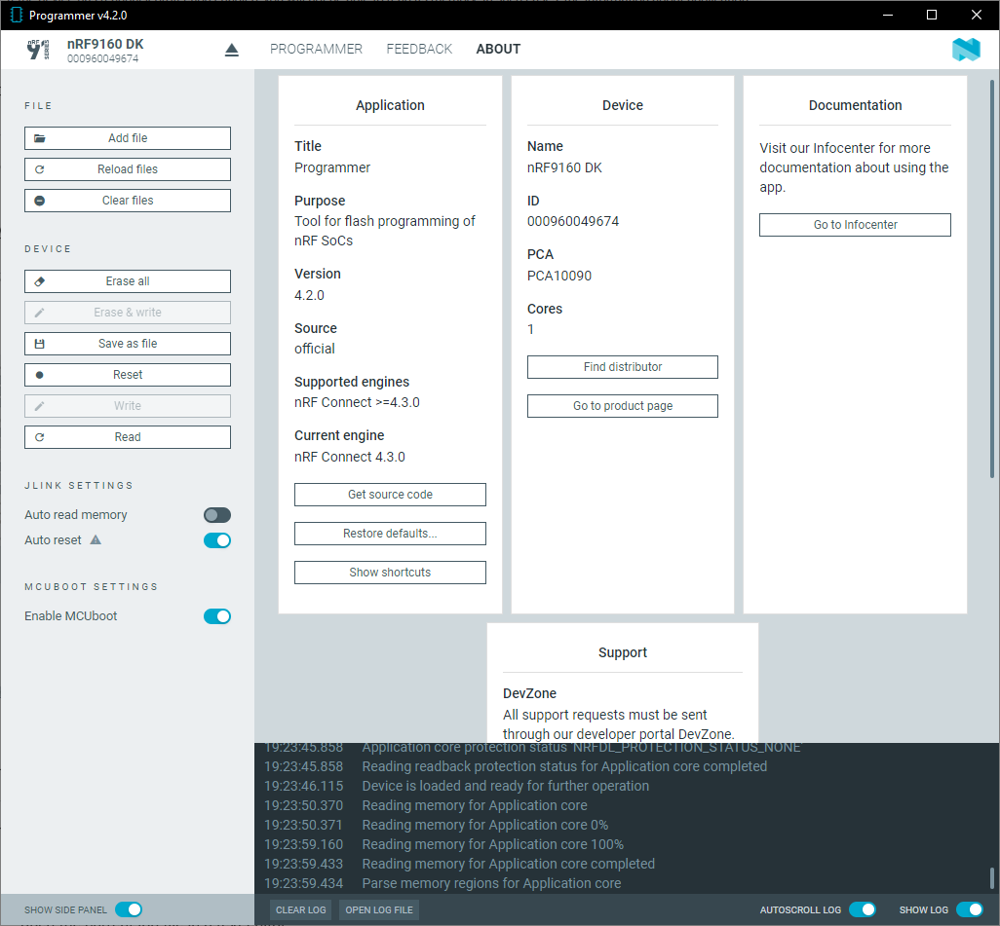

# Overview and user interface

The {{app_name}} main window displays the memory layout of the device and the file you want to work with. It also provides options to program the device and inspect the entire process through the log.

When you start the {{app_name}}, the application main window appears with the **Programmer** tab selected by default and the [**File Memory Layout**](#file-memory-layout) and [**Device Memory Layout**](#device-memory-layout) panels empty:

## Select device

Once you connect a device to the system, it becomes visible and available when you click on the **Select device** drop-down list. You can choose a device from the list of connected devices to perform further actions on the device such as programming.

## Device panel sections

The following options become available after selecting a device.

### File

When you select a device, the following actions are available in the File section:

| Action              | Description                                                                                        |
|---------------------|----------------------------------------------------------------------------------------------------|
| **Add files**       | Adds one or more files you select to the [**File Memory Layout**](#file-memory-layout) panel. You can select the files either from the drop-down list of previous files or by browsing to the file destination.              |
| **Reload files**    | Reloads the file you have previously added to the **File Memory Layout**.                          |
| **Clear files**     | Removes the file from the **File Memory Layout**.                                                  |

### Device

When you select a device, the following actions are available in the Device section, depending on the programming method:

| Action              | Programming method       | Description                                                                                        |
|---------------------|--------------------------|----------------------------------------------------------------------------------------------------|
| **Erase all**       | J-Link                   | Clears the written memory on the device.                                                           |
| **Erase & write**   | J-Link                   | Clears the written memory and programs the files added to the **File Memory Layout**.              |
| **Save as file**    | J-Link                   | After you **Read** the memory, saves the current memory layout in the **Device Memory Layout** to a HEX file.                     |
| **Reset**           | J-Link                   | Resets the device.                                                                                 |
| **Write**           | MCUboot, Nordic Secure DFU, Modem firmware | Programs the files added to the **File Memory Layout**.                                 |
| **Read**            | J-Link                   | Reads and displays the written memory in the **Device Memory Layout**, unless the device has readback protection enabled.  |

### J-Link Settings

When you select a device, the following toggles are available in the J-Link Settings section:

| Toggle                            | Description                                                                                          |
|-----------------------------------|------------------------------------------------------------------------------------------------------|
| **Auto read memory**              | Enable to automatically read and display the memory layout of the device when the device is selected. Data is only automatically read on non-protected devices. |
| **Auto reset**                    | Enable to automatically reset the device after it has been programmed to start the new binary.       |

### MCUboot Settings

The experimental **Enable MCUBoot** toggle is deprecated and will be removed in a future release of the {{app_name}}.

## Programmer tab

In the **Programmer** tab, you can see the memory sections for the selected device.

Both windows display the different sections in the memory with different colors.

### File Memory Layout

The **File Memory Layout** panel displays the memory layout for files added to the {{app_name}} with the [**Add file**](#file) option. Once added, these files can be programmed onto the device.

### Device Memory Layout

In the **Device Memory Layout**, you can read the name, address range, and size of a memory section by hovering the mouse cursor over one of the memory sections. This is possible only after loading a memory layout.

!!! note "Note"
      If the device has readback protection enabled, you will not be able to read its memory.
      In such cases, the information about application core being protected is displayed in the **Device Memory Layout** and the [**File**](#file) options **Read**, **Write**, and **Save as file** are disabled.

## About tab

You can view application information, restore defaults, access source code and documentation. You also can find information on the selected device, access support tools, send feedback, and enable verbose logging.

## Log

The Log panel allows you to view the most important log events, tagged with a timestamp. Each time you open the app, a new session log file is created. You can find the Log panel and its controls, below the main application Window.

- When troubleshooting, to view more detailed information than shown in the Log panel, use **Open log file** to open the current log file in a text editor.
- To clear the information currently displayed in the Log panel, use **Clear Log**. The contents of the log file are not affected.
- To hide or display the Log panel in the user interface, use **Show Log**.
- To freeze Log panel scrolling, use **Autoscroll Log**.