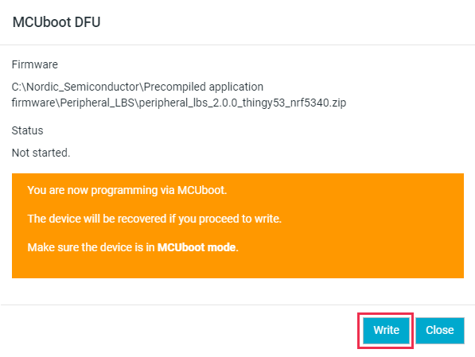
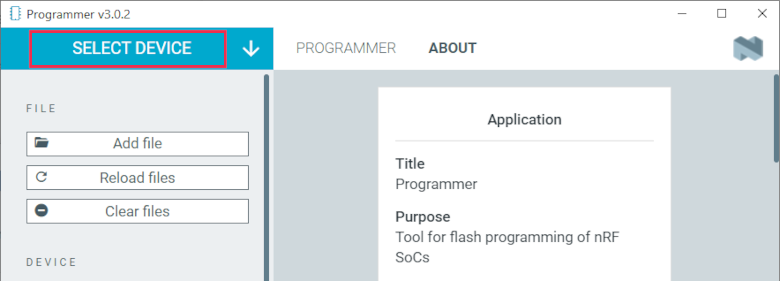

# Programming devices

In the {{app_name}}, you can program [supported devices](index.md#supported-devices) or a custom board with a supported chip that allows for communication with J-Link, Nordic Secure DFU devices, and MCUboot devices.

!!! tip "Tip"
      If you experience any problems during the programming process, press Ctrl-R (command-R on macOS) to restart the {{app_name}}, and try programming again.

## Device-specific procedures

The following devices have specific programming requirements or procedures:

| Device                            | Description                                                                                                          |
|-----------------------------------|----------------------------------------------------------------------------------------------------------------------|
| Nordic Thingy:91 X    | To program Nordic Thingy:91 X, see ???.
| Nordic Thingy:91      | To program Nordic Thingy:91, see [Updating the Thingy:91 firmware using Programmer](https://docs.nordicsemi.com/bundle/ncs-latest/page/nrf/device_guides/working_with_nrf/nrf91/thingy91.html#updating_the_thingy91_firmware_using_programmer).
| nRF9160 DK            | To program the nRF9160 DK, see [Updating the nRF9160 DK firmware using Programmer](https://docs.nordicsemi.com/bundle/ncs-latest/page/nrf/device_guides/working_with_nrf/nrf91/nrf9160.html#updating_the_dk_firmware_using_programmer). |
| Nordic Thingy:53      | To program Nordic Thingy:53, follow the steps from the [Programming Nordic Thingy:53](#programming-nordic-thingy53) section. |
| Nordic Thingy:52      | Nordic Thingy:52 can be programmed using the [general programming procedure](#general-programming-procedure), but only through J-Link and a 10-pin programming cable. |
| nRF52840 Dongle       | To program the nRF52840 Dongle, follow the steps from the [Programming the nRF52840 Dongle](#programming-the-nrf52840-dongle) section. |
| Custom board          | When programming a custom board with a supported chip, use the [general programming procedure](#general-programming-procedure), but make sure that the J-Link version is compatible with the relevant Arm® CPU. For example, an nRF52 Series DK cannot be used to program a Nordic Thingy:91 since the J-Link on an nRF52 Series DK does not support the programming of the Arm Cortex®-M33 CPU of Nordic Thingy:91. |

## General programming procedure

!!! note "Note"

      Do not unplug or turn off the device during programming.

To program a supported development kit, complete the following procedure:

1. Open nRF Connect for Desktop and launch the {{app_name}}.
2. Connect a development kit to the computer with a USB cable and turn it on.
3. Click **Select device** and choose the device from the drop-down list. 
   The button text changes to the name and serial number of the selected device, and the **Device Memory Layout** section indicates that the device is connected.
4. If you have not selected the **Auto read memory** option under the **Device** menu and wish to visually see the memory layout before you program, click **Read** in the menu. If you have selected it, the memory layout will update automatically.
5. Drag and drop the HEX file into the **File Memory Layout** section. Alternatively, click **Add file** to add the files you want to program, using one of the following options:

    - Select the files you used recently.
    - If there are no recently used files, click **Browse** from the drop-down list.

6. Select the firmware image file from the file browser that opens up; either a HEX file (in most cases) or a ZIP (when programming cellular modem firmware or multi-image programming with MCUboot).
7. Depending on the device type and the programming method, use one of the following programming options in the **Device** panel:

    - **Erase & write** for J-Link
    - **Write** for MCUboot, Nordic Secure DFU, or modem firmware

   When programming starts, a progress bar appears.

## Programming the nRF52840 Dongle

To program the nRF52840 Dongle, complete the following steps:

1. Open nRF Connect for Desktop and launch the {{app_name}}.
2. Insert the nRF52840 Dongle into a USB port on the computer.
3. Put the dongle into bootloader mode by pressing the **RESET** button.

    

    !!! note "Note"
         - This step is not needed if the currently running application uses the [DFU trigger library](https://docs.nordicsemi.com/bundle/sdk_nrf5_v17.1.0/page/lib_dfu_trigger_usb.html), part of the nRF5 SDK v17.1.0.
         - If this is the first time the dongle is connected, a driver needed for the nRF52840 Nordic Secure DFU feature is also installed as part of this step.

    The status light (**LD2**) will start pulsing red, indicating that the dongle is powered up and in bootloader mode. After a few seconds, the computer recognizes the dongle as a USB composite device.

5. In the navigation bar in the Programmer app, click **Select device** and choose the serial number of the dongle from the drop-down list.
6. Drag and drop the HEX file into the **File Memory Layout** section. Alternatively, click **Add file** to add the files you want to program, using one of the following options:

    - Select the files you used recently.
    - If there are no recently used files, click **Browse** from the drop-down list.

7. Select the firmware image file (with the extension HEX) from the file browser that opens up.
8. Click **Write** to program the firmware onto the dongle.

When the writing process completes, the device resets, and – unless the application uses the [DFU trigger library](https://docs.nordicsemi.com/bundle/sdk_nrf5_v17.1.0/page/lib_dfu_trigger_usb.html) of the nRF5 SDK v17.1.0 – the dongle will no longer show up in the Programmer app, as it is no longer in the bootloader mode.

## Programming Nordic Thingy:53

You can program the Nordic Thingy:53 application and network core firmware over USB by using MCUboot, which is a secure bootloader that you can use to update applications without an external debugger. MCUboot bootloader is [enabled by default](https://docs.nordicsemi.com/bundle/ncs-latest/page/nrf/app_dev/device_guides/thingy53/thingy53_application_guide.html#mcuboot_bootloader) for Thingy:53 in the `Kconfig.defconfig` file of the board.

You can follow this procedure to update the preloaded firmware on Nordic Thingy:53, using the precompiled application firmware available from the [Nordic Thingy:53 Downloads](https://www.nordicsemi.com/Products/Development-hardware/Nordic-Thingy-53/Downloads?lang=en#infotabs) page. The ZIP archive includes the ``CONTENTS.txt`` file, which lists the location and names of the different firmware images available.

To program Nordic Thingy:53, you can use one of the following options:

* Using USB-C cable
* Using an external debug probe

!!! note "Note"

      Do not unplug the Nordic Thingy:53 during this process.

### Programming using a USB-C cable

To program Nordic Thingy:53 using the USB-C connection, complete the following steps:

1. Take off the top cover of the Nordic Thingy:53 so you can access the **SW2** button in Step 7.
1. Plug the Nordic Thingy:53 into the computer using a USB-C cable.

    

1. Open nRF Connect for Desktop and launch the Programmer app.
1. Press **SW2** while moving the power switch **SW1** to the **ON** position.

    

1. In the Programmer navigation bar, click **Select device**. 
   A drop-down menu appears.
1. In the drop-down menu, select **Bootloader Thingy:53**.
1. Click **Add file** in the **FILE** section, and select **Browse**. 
   A file explorer window appears.
1. Navigate to the folder with the application firmware. 
   If you are programming the precompiled application firmware from the [Nordic Thingy:53 Downloads](https://www.nordicsemi.com/Products/Development-hardware/Nordic-Thingy-53/Downloads?lang=en#infotabs), open the folder where you extracted the archive. For example, the ``Peripheral_LBS`` folder.
1. Select the update file and click **Open**. 
   If you are programming the precompiled application firmware, the update file mentions the nRF Connect SDK version, for example ``peripheral_lbs_<version-number>_thingy53_nrf5340.zip``.
1. Click the **Write** button in the **DEVICE** section. 
   The **MCUboot DFU** window appears.

    

1. Click **Write** in the **MCUboot DFU** window. 
   The flash slot is erased. When the flash slot has been erased, image transfer starts and a progress bar appears.When the image transfer has been completed, the network core part of the image is transferred from RAM to the network core flash. This can take up to 20 seconds. 
   When the update is complete, a **Completed successfully** message appears.

You can now disconnect the Nordic Thingy:53 from the computer and put the top cover back on.

### Programming using an external debug probe

You can update the Nordic Thingy:53 application and network core firmware by using an external debug probe.

The external debug probe must support Arm Cortex-M33, such as the nRF5340 DK.
You need a 10-pin 2x5 socket-socket 1.27 mm IDC (Serial Wire Debug - SWD) JTAG cable to connect to the external debug probe.

To program Nordic Thingy:53 using an external debug probe, complete the following steps:

1. Open nRF Connect for Desktop and launch the Programmer app.
1. Prepare the hardware:

    a. Open the connector cover on the side of Nordic Thingy:53.

    b. Use a JTAG cable to connect Nordic Thingy:53 to the debug out port on a 10-pin external debug probe.

       

    c. Power on the Nordic Thingy:53; move the power switch **SW1** to the **ON** position.

    d. Power on the external debug probe.

    e. Connect the external debug probe to the computer with a micro-USB cable. 
       In the Programmer app's navigation bar, **No devices available** changes to **Select device**.

       

1. Click **Select device** and select the appropriate debug probe entry from the drop-down list. 
   The icon text changes to board name and the ID of the selected device, and the **Device memory layout** section indicates that the device is connected. 
   You can identify the nRF5340 DK by its PCA number PCA10095 and its ID that is printed on the label sticker on the DK.

    !!! note "Note"
         If the nRF5340 DK does not show up in the drop-down list, press Ctrl-R in Windows or command-R in macOS to restart the Programmer application.

1. Click **Add file** in the **FILE** section, and select **Browse**. 
   A file explorer window appears.
1. Navigate to the folder with the application firmware. 
   If you are programming the precompiled application firmware from the [Nordic Thingy:53 Downloads](https://www.nordicsemi.com/Products/Development-hardware/Nordic-Thingy-53/Downloads?lang=en#infotabs), open the folder where you extracted the archive.
1. Open the folder for the application that you want to transfer to the Nordic Thingy:53.
1. Select the corresponding HEX file to be used with the debug probe and click **Open**. 
   The HEX file appears in the **File memory layout** section.
1. Click **Erase & write** in the **DEVICE** section of the side panel.

The update is complete when the animation in the Programmer app's **Device memory layout** section ends.
