# Programming Nordic Thingy prototyping platforms

You can program the Nordic Thingy application and network core firmware over USB by using MCUboot, which is a secure bootloader that you can use to update applications without an external debugger. MCUboot bootloader is enabled by default for the Nordic Thingy prototyping platforms in the `Kconfig.defconfig` files of the board, available in either the [nRF Connect SDK](https://github.com/nrfconnect/sdk-nrf/tree/main/boards/nordic) or [Zephyr](https://github.com/zephyrproject-rtos/zephyr/tree/main/boards/nordic).

You can follow this procedure to update the preloaded firmware on the Nordic Thingy prototyping platforms using the precompiled application firmware available from the [Nordic Semiconductor website](https://www.nordicsemi.com/):

- [Nordic Thingy:91 X Downloads](https://www.nordicsemi.com/Products/Development-hardware/Nordic-Thingy-91-X/Download?lang=en#infotabs)
- [Nordic Thingy:91 Downloads](https://www.nordicsemi.com/Software-and-tools/Prototyping-platforms/Nordic-Thingy-91/Download#infotabs)
- [Nordic Thingy:53 Downloads](https://www.nordicsemi.com/Products/Development-hardware/Nordic-Thingy-53/Downloads?lang=en#infotabs)

The downloaded ZIP archive contains the following firmware:

=== "Nordic Thingy:91 X"

     - Application firmware - The ``img_app_bl`` folder contains full firmware images for different applications. The guides for programming through an external debug probe in this section use the images in this folder.
     - Application firmware for Device Firmware Update (DFU) - The images in the ``img_fota_dfu_bin`` and ``img_fota_dfu_hex`` folders contain firmware images for DFU. The guides for programming through USB in this section use the images in the ``img_fota_dfu_hex`` folder.
     - Modem firmware - The modem firmware is in a ZIP archive instead of a folder. The archive is named ``mfw_nrf91x1_`` followed by the firmware version number. Do not unzip this file.
     - The ``CONTENTS.txt`` file in the extracted folder contains the location and names of the different firmware images.

=== "Nordic Thingy:91"

     - Application firmware - The ``img_app_bl`` folder contains full firmware images for different applications. The guides for programming through an external debug probe in this section use the images in this folder.
     - Application firmware for Device Firmware Update (DFU) - The images in the ``img_fota_dfu_bin`` and ``img_fota_dfu_hex`` folders contain firmware images for DFU. The guides for programming through USB in this section use the images in the ``img_fota_dfu_hex`` folder.
     - Modem firmware - The modem firmware is in a ZIP archive instead of a folder. The archive is named ``mfw_nrf9160_`` followed by the firmware version number. Do not unzip this file.
     - The ``CONTENTS.txt`` file in the extracted folder contains the location and names of the different firmware images.

=== "Nordic Thingy:53"

     - Application firmware - The application folders contain the application firmware for the Thingy:53, including application firmware for Device Firmware Update (DFU).
     - The ``CONTENTS.txt`` file in the extracted folder contains the location and names of the different firmware images.

To program the Nordic Thingy prototyping platforms, you can use one of the following options:

* Using USB-C cable
* Using an external debug probe

!!! note "Note"

      Do not unplug the Nordic Thingy prototyping platform during this process.

## Programming using a USB-C cable

See the following sections for programming Nordic Thingy prototyping platforms using a USB-C cable.

### Nordic Thingy:91 X

To program Nordic Thingy using the USB-C connection, complete the following steps:

1. Connect the Thingy:91 X to your computer with a USB-C cable.
1. Power on the device by switching **SW1** to the **ON** position.
1. Open nRF Connect for Desktop and launch the Programmer app.
1. In the Programmer navigation bar, click **Select device**. 
   A drop-down menu appears.
1. In the drop-down menu, select **Bootloader Thingy:91 X**.
1. Click **Add file** in the **FILE** section, and select **Browse**. 
   A file explorer window appears.
1. Navigate to the folder with the application firmware in the ZIP format. 
   If you are programming the precompiled application firmware from the [Nordic Thingy:91 X Downloads](https://www.nordicsemi.com/Products/Development-hardware/Nordic-Thingy-91-X/Download?lang=en#infotabs), make sure to unzip the downloaded file and then open the ``img_dfu_zip`` folder inside.
1. Select the update file for the application you want to programand click **Open**.
1. Click the **Write** button in the **DEVICE** section. 
   The **MCUboot DFU** window appears.
1. Click **Write** in the **MCUboot DFU** window. 
   The flash slot is erased. When the flash slot has been erased, image transfer starts and a progress bar appears. When the image transfer has been completed, the network core part of the image is transferred from RAM to the network core flash. This can take up to 20 seconds. 
   When the update is complete, a **Completed successfully** message appears.

You can now disconnect the Nordic Thingy:91 X from the computer.

### Nordic Thingy:91

=== "Updating nRF52840 SoC firmware"

    To program Nordic Thingy using the USB-C connection, complete the following steps:

    !!! note "Note"
        To update the Thingy:91 through USB, the nRF9160 SiP and nRF52840 SoC bootloaders must be factory-compatible.
        The bootloaders might not be factory-compatible if the nRF9160 SiP or nRF52840 SoC has been updated with an external debug probe.
        To restore the bootloaders, program the nRF9160 SiP or nRF52840 SoC with factory-compatible Thingy:91 firmware files through an external debug probe.

      1. Open nRF Connect for Desktop and launch the {{app_name}}.
      1. Scroll down in the menu on the left and make sure **Enable MCUboot** is selected.

         

      1. Switch off the Thingy:91.
      1. Press **SW4** while switching **SW1** to the **ON** position.

         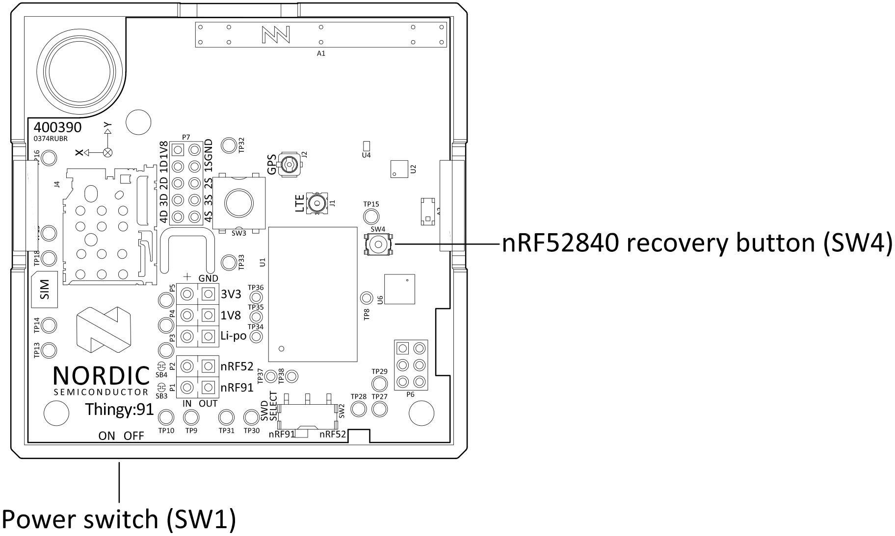

      1. In the Programmer navigation bar, click **SELECT DEVICE**. 
         A drop-down menu appears.

         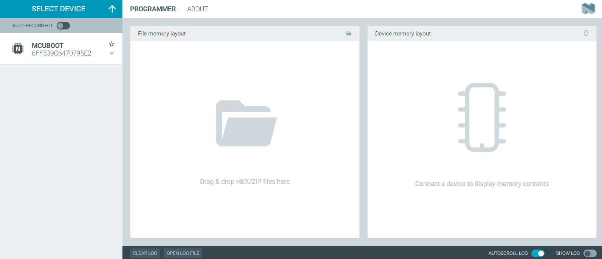

      1. In the menu, select the entry corresponding to your device (**MCUBOOT**).

        !!! note "Note"
            The device entry might not be the same in all cases and can vary depending on the application version and the operating system.

      1. In the menu on the left, click **Add file** in the **FILE** section, and select **Browse**. 
         A file explorer window appears.

         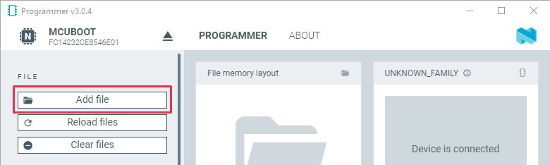

      1. Navigate to where you extracted the firmware.
      1. Open the folder `img_fota_dfu_hex` that contains the HEX files for updating over USB. 
         See the `CONTENTS.txt` file for information on which file you need.
      1. Select the Connectivity bridge firmware file.
      1. Click **Open**.
      1. Scroll down in the menu on the left to the **DEVICE** section and click **Write**.

         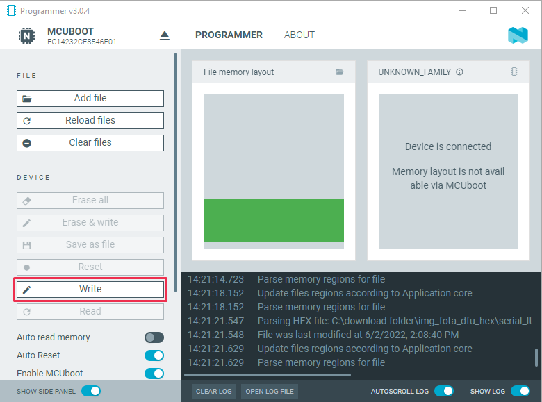

         The **MCUboot DFU** window appears.

         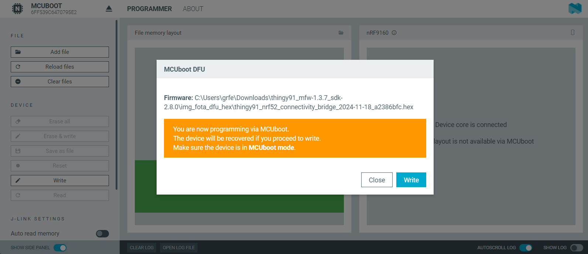

      1. In the **MCUboot DFU** window, click **Write**. 
         When the update is complete, a "Completed successfully" message appears.
      1. Scroll up in the menu on the left to the **FILE** section and click **Clear files**.

=== "Updating nRF9160 SiP modem firmware"

    To update the modem firmware using USB, complete the following steps:

      1. Open nRF Connect for Desktop and launch the {{app_name}} if it is not already open.
      1. Scroll down in the menu on the left and make sure **Enable MCUboot** is selected.
      1. Switch off the Thingy:91.
      1. Press **SW3** while switching **SW1** to the **ON** position.

         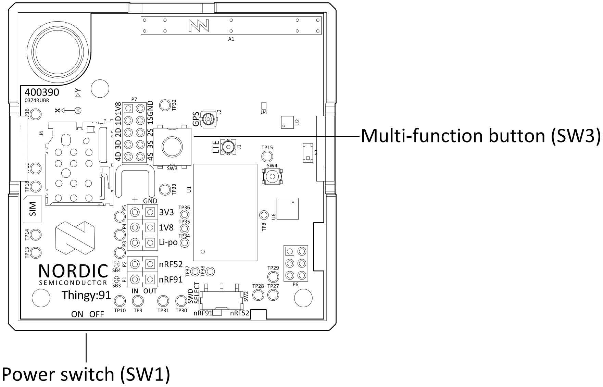

      1. In the Programmer navigation bar, click **SELECT DEVICE**. 
         A drop-down menu appears.
      1. In the menu, select the entry corresponding to your device (**Thingy:91**).
      1. In the menu on the left, click **Add file** in the **FILE** section, and select **Browse**. 
         A file explorer window appears.

         

      1. Navigate to where you extracted the firmware.
      1. Find the modem firmware zip file with a name similar to `mfw_nrf9160_*.zip` and the number of the latest version.

        !!! note "Note"
            Do not extract the modem firmware zip file.

      1. Select the zip file and click **Open**.
      1. Scroll down in the menu on the left to the **DEVICE** section and click **Write**.

         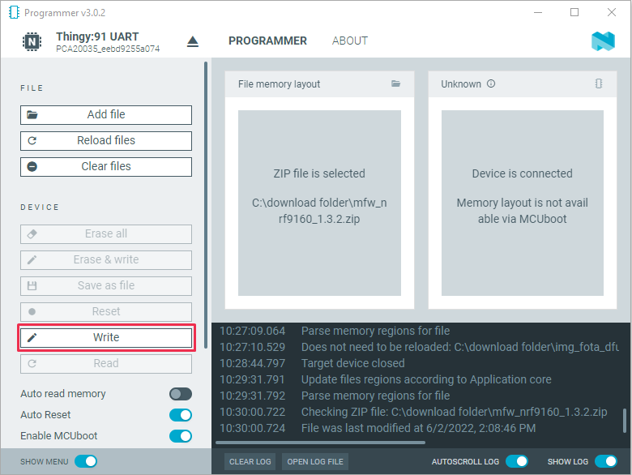

         The **Modem DFU via MCUboot** window appears.

         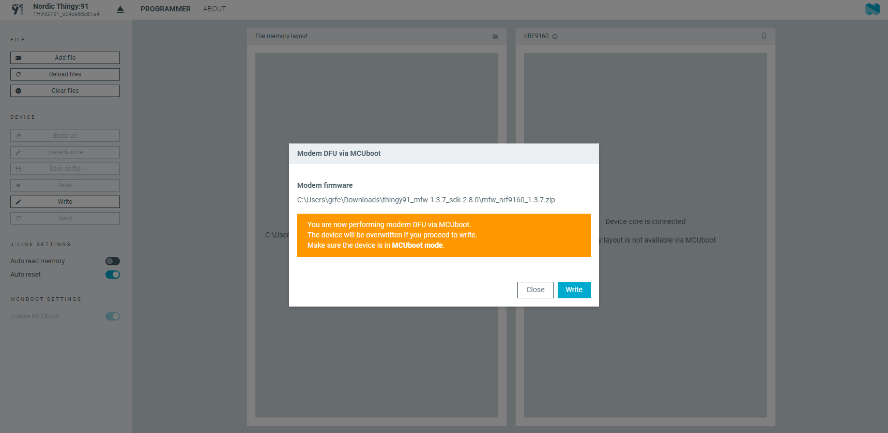

      1. In the **Modem DFU via MCUboot** window, click **Write**. 
         When the update is complete, a **Completed successfully** message appears.

=== "Updating nRF9160 SiP application"

    To update the modem firmware using USB, complete the following steps:

    1. Open nRF Connect for Desktop and launch the Programmer app if it is not already open.
    1. Make sure that **Enable MCUboot** is selected.
    1. Switch off the Thingy:91.
    1. Press **SW3** while switching **SW1** to the **ON** position.

        

    1. In the menu, select **Thingy:91**.
    1. In the menu on the left, click **Add file** in the **FILE** section, and select **Browse**. 
       A file explorer window appears.

        

    1. Navigate to where you extracted the firmware.
    1. Find the modem firmware zip file with a name similar to `mfw_nrf9160_*.zip` and the number of the latest version.

        !!! note "Note"
            Do not extract the modem firmware zip file.

    1. Select the zip file and click **Open**.
    1. In the Programmer app, scroll down in the menu on the left to the **DEVICE** section and click **Write**.

        

        The **Modem DFU via MCUboot** window appears.

        

    1. In the **Modem DFU via MCUboot** window, click **Write**. 
       When the update is complete, a **Completed successfully** message appears.

### Nordic Thingy:53

To program Nordic Thingy using the USB-C connection, complete the following steps:

1. Take off the top cover of the Nordic Thingy:53 so you can access the **SW2** button in Step 7.
1. Plug the Nordic Thingy:53 into the computer using a USB-C cable.

    

1. Open nRF Connect for Desktop and launch the Programmer app.
1. Press **SW2** while moving the power switch **SW1** to the **ON** position.

    

1. In the Programmer navigation bar, click **Select device**. 
   A drop-down menu appears.
1. In the drop-down menu, select **Bootloader Thingy:53**.
1. Click **Add file** in the **FILE** section, and select **Browse**. 
   A file explorer window appears.
1. Navigate to the folder with the application firmware. 
   If you are programming the precompiled application firmware from the [Nordic Thingy:53 Downloads](https://www.nordicsemi.com/Products/Development-hardware/Nordic-Thingy-53/Downloads?lang=en#infotabs), open the folder where you extracted the archive. For example, the ``Peripheral_LBS`` folder.
1. Select the update file and click **Open**. 
   If you are programming the precompiled application firmware, the update file mentions the nRF Connect SDK version, for example ``peripheral_lbs_<version-number>_thingy53_nrf5340.zip``.
1. Click the **Write** button in the **DEVICE** section. 
   The **MCUboot DFU** window appears.

    

1. Click **Write** in the **MCUboot DFU** window. 
   The flash slot is erased. When the flash slot has been erased, image transfer starts and a progress bar appears. When the image transfer has been completed, the network core part of the image is transferred from RAM to the network core flash. This can take up to 20 seconds. 
   When the update is complete, a **Completed successfully** message appears.

You can now disconnect the Nordic Thingy:53 from the computer and put the top cover back on.

### Programming using an external debug probe

You can update the Nordic Thingy application and network core firmware by using an external debug probe.

The external debug probe must support Arm Cortex-M33.
You need a 10-pin 2x5 socket-socket 1.27 mm IDC (Serial Wire Debug - SWD) JTAG cable to connect to the external debug probe.

### Nordic Thingy:91 X

To program Nordic Thingy:91 X using an external debug probe, complete the following steps:

1. Open nRF Connect for Desktop and launch the Programmer app.
1. Prepare the hardware:

    a. Open the connector cover on the side of Nordic Thingy:91 X.

    b. Use a JTAG cable to connect Nordic Thingy:91 X to the debug out port on a 10-pin external debug probe.

    c. Power on the Nordic Thingy:91 X; move the power switch **SW1** to the **ON** position.

    d. Power on the external debug probe.

    e. Connect the external debug probe to the computer with a micro-USB cable. 
       In the {{app_name}}'s navigation bar, **No devices available** changes to **Select device**.

     

1. Click **Select device** and select the appropriate debug probe entry from the drop-down list. 
   The icon text changes to board name and the ID of the selected device, and the **Device memory layout** section indicates that the device is connected. 
   For example, you can identify the nRF5340 DK by its PCA number PCA10095 and its ID that is printed on the label sticker on the DK.

    !!! note "Note"
        If the nRF5340 DK does not show up in the drop-down list, press Ctrl-R in Windows or command-R in macOS to restart the {{app_name}}.

1. Click **Add file** in the **FILE** section, and select **Browse**. 
   A file explorer window appears.
1. Navigate to the folder with the application firmware in the HEX format. 
   If you are programming the precompiled application firmware from the [Nordic Thingy:91 X Downloads](https://www.nordicsemi.com/Products/Development-hardware/Nordic-Thingy-91-X/Download?lang=en#infotabs), make sure to unzip the downloaded file and then open the ``img_app_bl`` folder inside.
1. Open the folder for the application that you want to transfer to the Nordic Thingy:91 X.
1. Select the corresponding HEX file to be used with the debug probe and click **Open**. 
   The HEX file appears in the **File memory layout** section.
1. Click **Erase & write** in the **DEVICE** section of the side panel.

The update is complete when the animation in the {{app_name}}'s **Device memory layout** section ends.

### Nordic Thingy:91

=== "Updating nRF52840 SoC firmware"

    To update the nRF52840 SoC firmware on the Thingy:91 using the nRF9160 DK as an external debug probe, complete the following steps:

     1. Open nRF Connect for Desktop and launch the Programmer app.
     1. Prepare the hardware:

        a. Connect the Thingy:91 to the debug out port on a 10-pin external debug probe using a JTAG cable.

         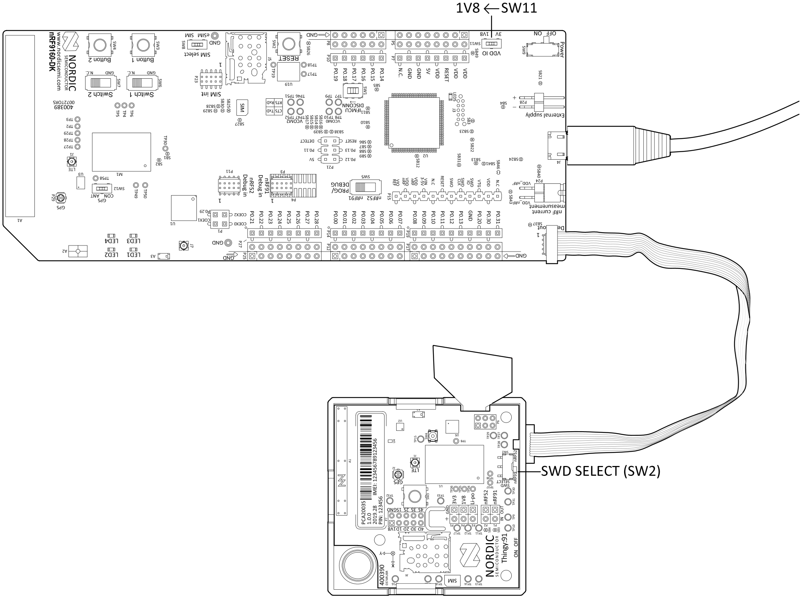

        !!! note "Note"
            When using the nRF9160 DK as the debug probe, make sure that VDD_IO (SW11) is set to 1.8 V on the nRF9160 DK.

        b. Make sure that both the Thingy:91 and the external debug probe are powered on.

        !!! note "Note"
            Do not unplug or power off the devices during this process.

        c. Connect the external debug probe to the computer with a micro-USB cable. 
           In the {{app_name}}'s navigation bar, **No devices available** changes to **SELECT DEVICE**.

           

     1. Click **SELECT DEVICE** and select the appropriate debug probe entry from the drop-down list. 
        Select the nRF9160 DK from the list.

         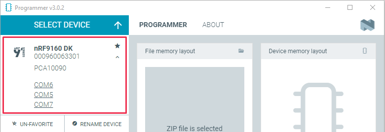

        The button text changes to the SEGGER ID of the selected device, and the **Device memory layout** section indicates that the device is connected.

     1. Set the SWD selection switch **SW2** to **nRF52** on the Thingy:91. 
        See the SWD Select section for more information on the switch.
     1. In the menu on the left, click **Add file** in the **FILE** section, and select **Browse**. 
        A file explorer window appears.

         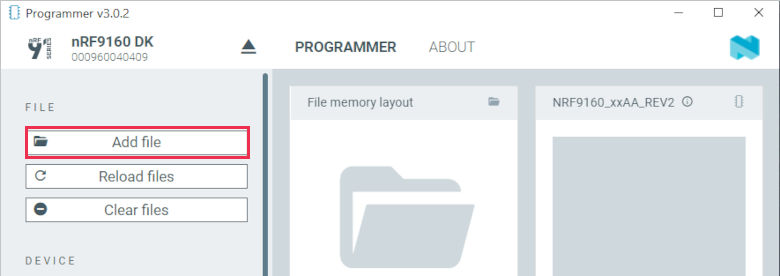

     1. Navigate to where you extracted the firmware.
     1. Open the `img_app_bl` folder that contains the HEX files for flashing with a debugger. 
        See the `CONTENTS.txt` file for information on which file you need.
     1. Select the Connectivity bridge firmware file and click **Open**.
     1. Scroll down in the menu on the left to the **DEVICE** section and click **Erase & write**. 
        The update is complete when the animation in the {{app_name}}'s **Device memory layout** window ends.

         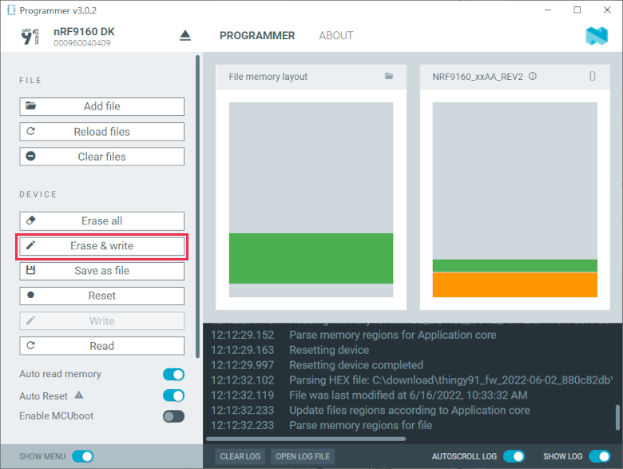

     1. Scroll up in the menu on the left to the **FILE** section and click **Clear files**.

=== "Updating nRF9160 SiP modem firmware"

    To update the modem firmware on the Thingy:91 using an external debug probe, complete the following steps:

     1. Open nRF Connect for Desktop and launch the Programmer app. Prepare the hardware as described above if you have not done so already.
     1. Set the SWD selection switch **SW2** to **nRF91** on the Thingy:91.
     1. In the menu on the left, click **Add file** in the **FILE** section, and select **Browse**. 
        A file explorer window appears.

         

     1. Navigate to where you extracted the firmware.
     1. Find the modem firmware zip file with a name similar to `mfw_nrf9160_*.zip` (with the latest version number) and click **Open**.

        !!! note "Note"
            Do not extract the modem firmware zip file.

     1. Select the zip file and click **Open**.
     1. In the {{app_name}}, scroll down in the menu on the left to the **DEVICE** section and click **Write**.

         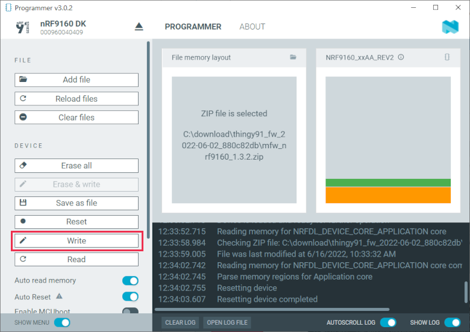

         The **Modem DFU** window appears.

         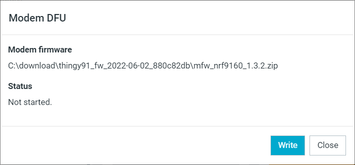

     1. In the **Modem DFU** window, click **Write**. 
        When the update is complete, a "Completed successfully" message appears.

        !!! note "Note"
            Before trying to update the modem again, click the **Erase all** button. This deletes the contents of the flash memory and the applications must be reprogrammed.

=== "Updating nRF9160 SiP application"

    To program the nRF9160 SiP application firmware on the Thingy:91 using an external debug probe, complete the following steps:

     1. Open nRF Connect for Desktop and launch the Programmer app. Prepare the hardware as described above if you have not done so already.
     1. Make sure the SWD selection switch **SW2** is set to **nRF91** on the Thingy:91.
     1. In the menu on the left, click **Add file** in the **FILE** section, and select **Browse**. 
        A file explorer window appears.

         

     1. Navigate to where you extracted the firmware.
     1. Open the `img_app_bl` folder that contains the HEX files for updating using a debugger. 
         See the `CONTENTS.txt` file for information on which file you need.
     1. Select the appropriate AT Client firmware file and click **Open**.
     1. Scroll down in the menu on the left to the **DEVICE** section and click **Erase & write**. 
         The update is complete when the animation in the {{app_name}}'s **Device memory layout** window ends.

         

     1. Scroll up in the menu on the left to the **FILE** section and click **Clear files**.

### Nordic Thingy:53

To program Nordic Thingy:53 using an external debug probe, complete the following steps:

1. Open nRF Connect for Desktop and launch the Programmer app.
1. Prepare the hardware:

    a. Open the connector cover on the side of Nordic Thingy:53.

    b. Use a JTAG cable to connect Nordic Thingy:53 to the debug out port on a 10-pin external debug probe.

       

    c. Power on the Nordic Thingy:53; move the power switch **SW1** to the **ON** position.

    d. Power on the external debug probe.

    e. Connect the external debug probe to the computer with a micro-USB cable. 
       In the Programmer app's navigation bar, **No devices available** changes to **Select device**.

       

1. Click **Select device** and select the appropriate debug probe entry from the drop-down list. 
   The icon text changes to board name and the ID of the selected device, and the **Device memory layout** section indicates that the device is connected. 
   You can identify the nRF5340 DK by its PCA number PCA10095 and its ID that is printed on the label sticker on the DK.

    !!! note "Note"
        If the nRF5340 DK does not show up in the drop-down list, press Ctrl-R in Windows or command-R in macOS to restart the Programmer application.

1. Click **Add file** in the **FILE** section, and select **Browse**. 
   A file explorer window appears.
1. Navigate to the folder with the application firmware. 
   If you are programming the precompiled application firmware from the [Nordic Thingy:53 Downloads](https://www.nordicsemi.com/Products/Development-hardware/Nordic-Thingy-53/Downloads?lang=en#infotabs), open the folder where you extracted the archive.
1. Open the folder for the application that you want to transfer to the Nordic Thingy:53.
1. Select the corresponding HEX file to be used with the debug probe and click **Open**. 
   The HEX file appears in the **File memory layout** section.
1. Click **Erase & write** in the **DEVICE** section of the side panel.

The update is complete when the animation in the Programmer app's **Device memory layout** section ends.
