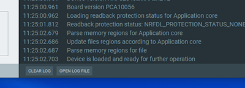

# Troubleshooting

When troubleshooting, to view more detailed information than shown in the Log panel, use **Open log file** to open the current log file in a text editor.

The Programmer app shares several troubleshooting issues and suggested solutions with the nRF Connect Bluetooth® Low Energy app. Refer to the troubleshooting section in the [nRF Connect Bluetooth Low Energy user guide](https://docs.nordicsemi.com/bundle/ug_nrfconnect_ble/page/UG/nRF_Connect_BLE/nRF_Connect_intro.html) for the list of issues.

## Programming a Device

If you are unable to program a device with the **Write** button, verify that:

- You are trying to program a supported device.
- There are no issues with the HEX file, and the addresses mentioned within the file are correct.

## Restarting the Programmer app

You can restart the Programmer app by pressing **Ctrl+R** in Windows and **Command+R** in macOS. A restart might be required in the following scenarios:

- A device is reset while it is connected to the Programmer app. In this case, you may not see all COM ports in the drop-down list while selecting the device (e.g., nRF9160 DK) in the Programmer app.
- Other errors.